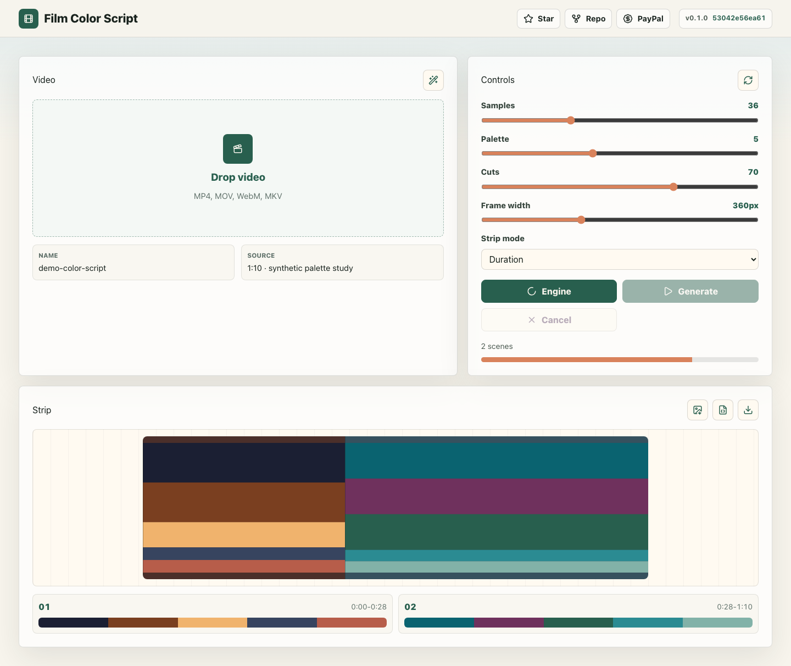
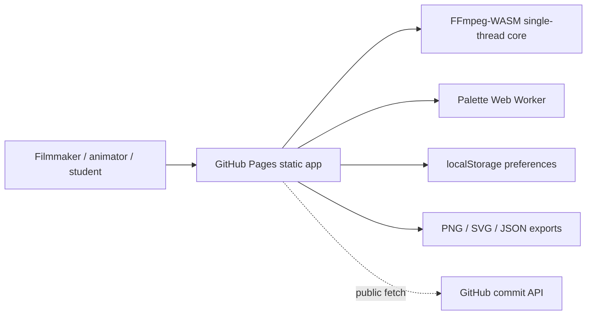

# Film Color Script Generator


Live site: https://baditaflorin.github.io/film-color-script-generator/

Repository: https://github.com/baditaflorin/film-color-script-generator

Support: https://www.paypal.com/paypalme/florinbadita

Client-side tool that samples video key frames with FFmpeg-WASM, extracts per-scene palettes, and exports a horizontal color-script strip for animation and cinematography study. Videos stay local in the browser; there is no backend, no account, and no upload path.



## Quickstart

```bash
git clone https://github.com/baditaflorin/film-color-script-generator.git
cd film-color-script-generator
npm install
make install-hooks
make dev
```

## Checks

```bash
make lint
make test
make build
make smoke
```

## Architecture



Architecture details: docs/architecture.md

ADRs: docs/adr/

Deploy guide: docs/deploy.md

Privacy: docs/privacy.md

## Make Targets

Run `make help` for the full target list. Mode A intentionally leaves backend, Docker, Compose, and data-pipeline targets as no-ops.

## Notes

- Initial app shell is under 200 KB gzipped.
- FFmpeg-WASM is lazy-loaded after user action.
- Built GitHub Pages output is committed under `docs/`.
- The live page shows the app version and current main-branch commit.
