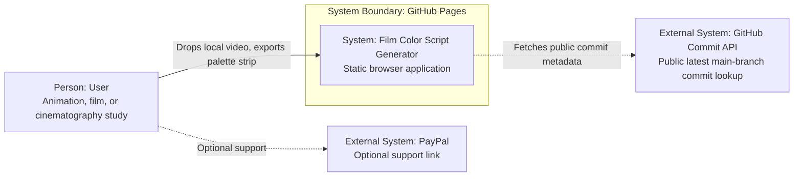
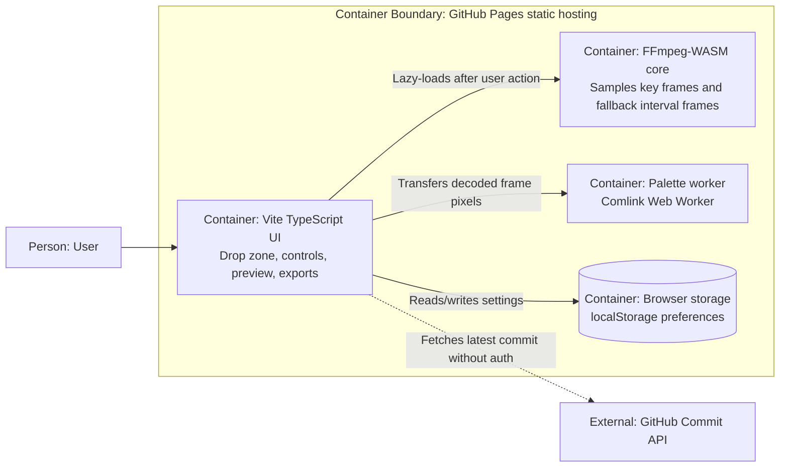

# Architecture

## Context

Film Color Script Generator is a Mode A GitHub Pages application. It processes video files in the browser, extracts frame palettes, groups sampled frames into scenes, and exports local artifacts.

Live URL:

https://baditaflorin.github.io/film-color-script-generator/

Repository:

https://github.com/baditaflorin/film-color-script-generator

## C4 Context

## C4 Container

## Module Boundaries

- `src/app.ts`: DOM state, interactions, progress, exports.
- `src/features/color-script/ffmpeg.ts`: FFmpeg-WASM loading and frame extraction.
- `src/features/color-script/palette.ts`: pure color analysis logic.
- `src/features/color-script/scenes.ts`: scene grouping.
- `src/features/color-script/export.ts`: PNG, SVG, and JSON export creation.
- `src/features/color-script/palette.worker.ts`: Comlink worker facade.
- `src/features/storage/preferences.ts`: local preferences.
- `src/features/github/latestCommit.ts`: public commit metadata fetch.

## Deployment Boundary

Only `docs/` is served publicly by GitHub Pages. There is no runtime server, database, Docker image, nginx host, or secret-bearing process.
